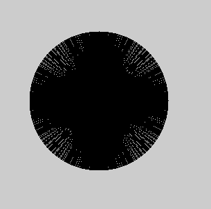
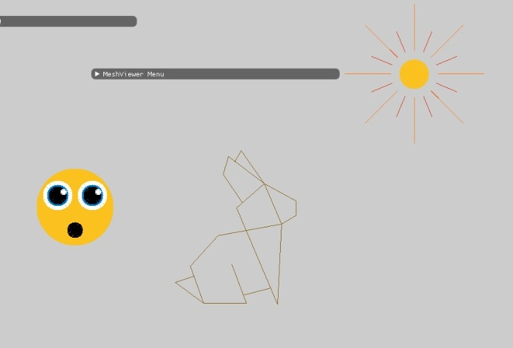

## 1. Our implementation of the algorithm
## Bresenham Code
```cpp
    void Renderer::DrawLine(const glm::ivec2& p1, const glm::ivec2& p2, const glm::vec3& color)
    {
        double x1,y1,x2,y2;
        double dY = p2[1] - p1[1];
        double dX = p2[0] - p1[0];
        double a;
        int c=1;
        double e;
        if(dX==0) 
            if(dY<0)
                a=-2;
            else
                a=2;
        else
            a = dY/dX;
        
        if(a<0) // check if needed reflaction 
            c=-1;
        x1 = p1[0];
        y1 = p1[1];
        x2 = p2[0];
        y2 = p2[1];
        if(a<=1 && a>=-1){//run on x (like the original algorithm)
            if(dX<0){ // if x1 is lower than x2 draw line from (x2,y2) to (x1,y1) 
                x1 = p2[0];
                y1 = p2[1];
                x2 = p1[0];
                y2 = p1[1];
                dX = -dX;
                dY = -dY;
            }
            e = -dX;
            while(x1<=x2){
                if(e>0){
                    y1+=c;
                    e-=2*dX;
                }
                PutPixel(x1,y1,color);
                x1++;
                e+=2*c*dY;
            }

        }
        else{ //swith between x and y run on y instead
            if(dY<0){
                x1 = p2[0];
                y1 = p2[1];
                x2 = p1[0];
                y2 = p1[1];
                dX = -dX;
                dY = -dY;
            }
            e = -dX;
            while(y1<=y2){
                if(e>0){
                    x1+=c;
                    e-=2*dY;
                }
                PutPixel(x1,y1,color);
                y1++;
                e+=c*2*dX;
            }
        }


    }
```

## Draw Circle Code
```cpp
    void Renderer::DrawCircle(const glm::vec2& center, double radius,const glm::vec3& color, int a=1000)
    {
        for(double i=0; i < a; i+=1){
            glm::ivec2 p2(center[0] + radius*sin((2*M_PI*i)/a), center[1] + radius * cos((2 * M_PI * i) / a));
            DrawLine(center, p2,  color);
        }
    }
```
## 2. Sanity Check
We are draw many line's from the center of the circle to the edge's



## 3. Draw of our Choice



```cpp
	int half_width = viewport_width / 2;
	int half_height = viewport_height / 2;

	int x = 3;
	glm::vec3 yellow(0.9822, 0.7568, 0.1215);
	glm::vec3 blue(0, 0.506, 0.8156);
	glm::vec3 white(1, 1, 1);
	glm::vec3 black(0, 0, 0);
	glm::ivec2 p_smiley((half_width-300)/x+300, half_height/x+200);
	glm::ivec2 left_up((half_width-180)/x+300, (half_height+80)/x+200);
	glm::ivec2 right_up((half_width -360)/x+300, (half_height+80)/x+200);
	glm::ivec2 left((half_width-210)/x+300, (half_height+60)/x+200);
	glm::ivec2 right((half_width - 390)/x+300, (half_height+60)/x+200);
	glm::ivec2 m((half_width - 300)/x+300, (half_height-120)/x+200);

	//smile
	this->DrawCircle(p_smiley, 200/x, yellow);
	this->DrawCircle(left, 75/x,white);
	this->DrawCircle(left, 55/x, blue);
	this->DrawCircle(left, 45/x, black);
	this->DrawCircle(left_up, 15/x, white);
	this->DrawCircle(right, 75/x, white);
	this->DrawCircle(right, 55/x, blue);
	this->DrawCircle(right, 45/x, black);
	this->DrawCircle(right_up, 15/x, white);
	this->DrawCircle(m, 40/x, black);

	glm::ivec2 sun(1000, 550);
	glm::ivec2 p1(half_width + 100, half_height);
	glm::ivec2 p2(half_width + 60, half_height + 57);
	glm::ivec2 p3(half_width + 49, half_height + 38);
	glm::ivec2 p4(half_width + 38, half_height+47);
	glm::ivec2 p5(half_width + 29, half_height+16);
	glm::ivec2 p6(half_width + 62, half_height-33);
	glm::ivec2 p7(half_width + 52, half_height-42);
	glm::ivec2 p8(half_width + 123, half_height-209);
	glm::ivec2 p9(half_width + 130, half_height-70);
	glm::ivec2 p10(half_width + 155, half_height-30);
	glm::ivec2 p11(half_width + 155, half_height-55);
	glm::ivec2 p12(half_width + 20, half_height-90);
	glm::ivec2 p13(half_width - 28, half_height-143);
	glm::ivec2 p14(half_width - 5, half_height-207);
	glm::ivec2 p15(half_width + 69, half_height - 207);
	glm::ivec2 p16(half_width + 44, half_height - 140);
	glm::ivec2 p17(half_width + 64, half_height - 193);
	glm::ivec2 p18(half_width + 110, half_height - 181);
	glm::ivec2 p19(half_width - 54, half_height - 171);
	glm::ivec2 p20(half_width - 21, half_height - 160);
	glm::vec3 color(0.8, 0.8, 0.8);
	glm::vec3 red(0.866, 0.2352, 0.1333);
	glm::vec3 orange(1, 0.4941, 0.1137);
	glm::vec3 brown(0.549, 0.4, 0.1372);

	//bunny
	this->DrawLine(p1, p2, brown);
	this->DrawLine(p2, p3, brown);
	this->DrawLine(p1, p4, brown);
	this->DrawLine(p4, p5, brown);
	this->DrawLine(p5, p6, brown);
	this->DrawLine(p1, p7, brown);
	this->DrawLine(p7, p8, brown);
	this->DrawLine(p8, p9, brown);
	this->DrawLine(p1, p9, brown);
	this->DrawLine(p1, p10, brown);
	this->DrawLine(p10, p11, brown);
	this->DrawLine(p11, p9, brown);
	this->DrawLine(p9, p12, brown);
	this->DrawLine(p13, p12, brown);
	this->DrawLine(p13, p14, brown);
	this->DrawLine(p15, p14, brown);
	this->DrawLine(p15, p16, brown);
	this->DrawLine(p17, p18, brown);
	this->DrawLine(p14, p19, brown);
	this->DrawLine(p20, p19, brown);

	//sun
	this->DrawCircle(sun, 80,red,16);
	this->DrawCircle(sun, 120,orange, 8);

	this->DrawCircle(sun,  40,color, 1000);

	this->DrawCircle(sun, 25, yellow, 1000);
```