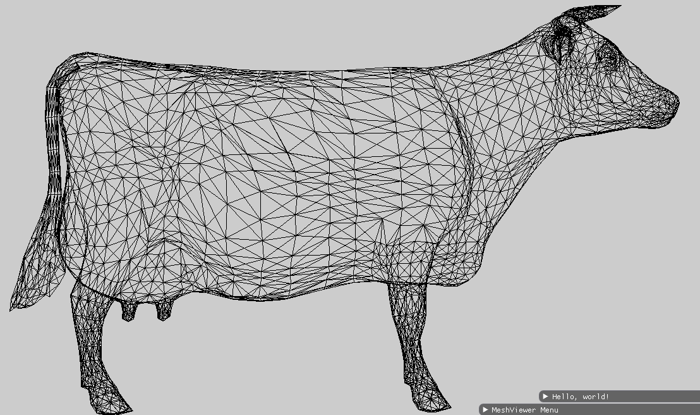
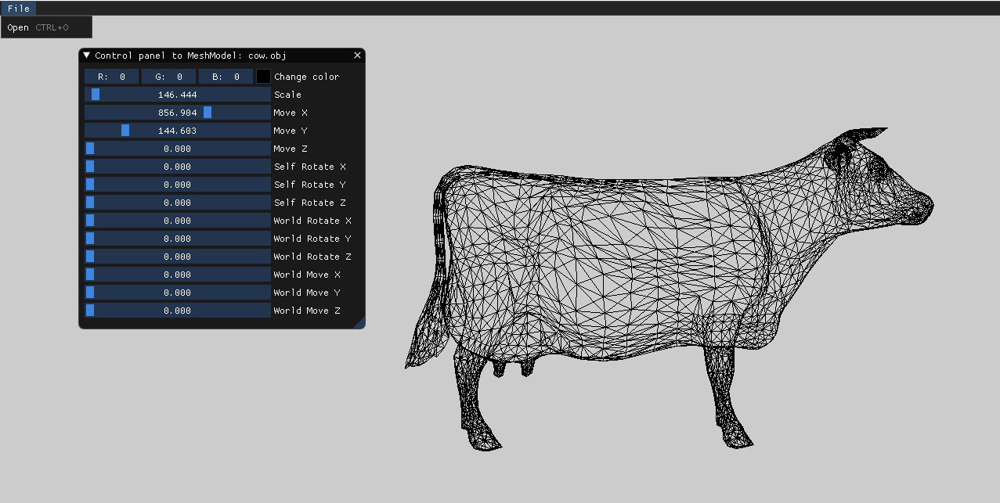

## 1. Load Mesh Model
## print vertices and faces
```cpp
Vertices - 14-
0.00000	0.00000	0.00000
2.00000	0.00000	0.00000
2.00000	2.00000	0.00000
0.00000	2.00000	0.00000
0.00000	0.00000	-2.00000
2.00000	0.00000	-2.00000
2.00000	2.00000	-2.00000
0.00000	2.00000	-2.00000
-0.60000	1.00000	-1.00000
1.00000	-0.60000	-1.00000
2.60000	1.00000	-1.00000
1.00000	2.60000	-1.00000
1.00000	1.00000	0.60000
1.00000	1.00000	-2.60000
Faces - 24-
0: { [v: 1  vt: 0  vn: 1][v: 13  vt: 0  vn: 2][v: 4  vt: 0  vn: 1] } 
1: { [v: 4  vt: 0  vn: 3][v: 13  vt: 0  vn: 4][v: 3  vt: 0  vn: 3] } 
2: { [v: 3  vt: 0  vn: 5][v: 13  vt: 0  vn: 6][v: 2  vt: 0  vn: 5] } 
3: { [v: 2  vt: 0  vn: 7][v: 13  vt: 0  vn: 8][v: 1  vt: 0  vn: 7] } 
4: { [v: 4  vt: 0  vn: 1][v: 9  vt: 0  vn: 9][v: 1  vt: 0  vn: 1] } 
5: { [v: 8  vt: 0  vn: 10][v: 9  vt: 0  vn: 11][v: 4  vt: 0  vn: 10] } 
6: { [v: 5  vt: 0  vn: 12][v: 9  vt: 0  vn: 13][v: 8  vt: 0  vn: 12] } 
7: { [v: 1  vt: 0  vn: 14][v: 9  vt: 0  vn: 15][v: 5  vt: 0  vn: 14] } 
8: { [v: 5  vt: 0  vn: 16][v: 14  vt: 0  vn: 17][v: 6  vt: 0  vn: 16] } 
9: { [v: 8  vt: 0  vn: 12][v: 14  vt: 0  vn: 18][v: 5  vt: 0  vn: 12] } 
10: { [v: 7  vt: 0  vn: 19][v: 14  vt: 0  vn: 20][v: 8  vt: 0  vn: 19] } 
11: { [v: 6  vt: 0  vn: 21][v: 14  vt: 0  vn: 22][v: 7  vt: 0  vn: 21] } 
12: { [v: 3  vt: 0  vn: 23][v: 11  vt: 0  vn: 24][v: 7  vt: 0  vn: 23] } 
13: { [v: 2  vt: 0  vn: 5][v: 11  vt: 0  vn: 25][v: 3  vt: 0  vn: 5] } 
14: { [v: 6  vt: 0  vn: 26][v: 11  vt: 0  vn: 27][v: 2  vt: 0  vn: 26] } 
15: { [v: 7  vt: 0  vn: 21][v: 11  vt: 0  vn: 28][v: 6  vt: 0  vn: 21] } 
16: { [v: 3  vt: 0  vn: 3][v: 12  vt: 0  vn: 29][v: 4  vt: 0  vn: 3] } 
17: { [v: 4  vt: 0  vn: 10][v: 12  vt: 0  vn: 30][v: 8  vt: 0  vn: 10] } 
18: { [v: 8  vt: 0  vn: 19][v: 12  vt: 0  vn: 31][v: 7  vt: 0  vn: 19] } 
19: { [v: 7  vt: 0  vn: 23][v: 12  vt: 0  vn: 32][v: 3  vt: 0  vn: 23] } 
20: { [v: 1  vt: 0  vn: 7][v: 10  vt: 0  vn: 33][v: 2  vt: 0  vn: 7] } 
21: { [v: 2  vt: 0  vn: 26][v: 10  vt: 0  vn: 34][v: 6  vt: 0  vn: 26] } 
22: { [v: 6  vt: 0  vn: 16][v: 10  vt: 0  vn: 35][v: 5  vt: 0  vn: 16] } 
23: { [v: 5  vt: 0  vn: 14][v: 10  vt: 0  vn: 36][v: 1  vt: 0  vn: 14] } 
```

## 2. Scale and Translate
	To make the transfomation, first we created 2 matrices,
	one for the translate and one for scaling,
	and than we multiplied them (translate * scale * vertices).
	to make the object fit the screen we adjust the cordinate of the matrices.	

## 3. ScreenShot Of The Model



## 4. GUI Controler



    we have 2 main matrices, local matrix and world matrix
    for the local matrix the multiply is:
    local matrix = (translate * scale * rotation)
    and than for the world matrix the multiply is:
    world matrix = (translate * rotation)
    and finally we multiply:
    vertices = world matrix * local matrix * vertices

## 5. Translate & Rotation: World vs Local 
### Local Translate and World Rotation


https://user-images.githubusercontent.com/100534541/204522559-29f7537b-a162-4859-b266-070086d78303.mp4


### World Translate and Local Rotation


https://user-images.githubusercontent.com/100534541/204522595-c258574d-1b11-4e79-8732-33dea2353b31.mp4


## 6. Load Multiple Models


https://user-images.githubusercontent.com/100534541/204522626-daad6ba4-c488-441b-9878-7337710850ae.mp4


## 7.Mouse And Keyboards 
```
we add the keyboard function:
    - right arrow to move localy right
    - left arrow to move localy left
    - up arrow to move localy up
    - down to move localy down
and we add mouse click function:
    - left click to zoom out
    - right click to zoom in
```
