## 1. Implement the ability to add point lights to the scene and material to models


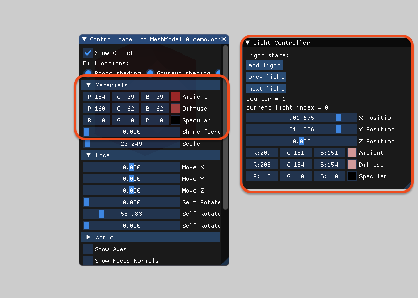

```
now i choise ambiante bordo to the banana, but he is still black,
 its couse the ambient ligth vector is zero's,
 so the final color is zero -> black.
```

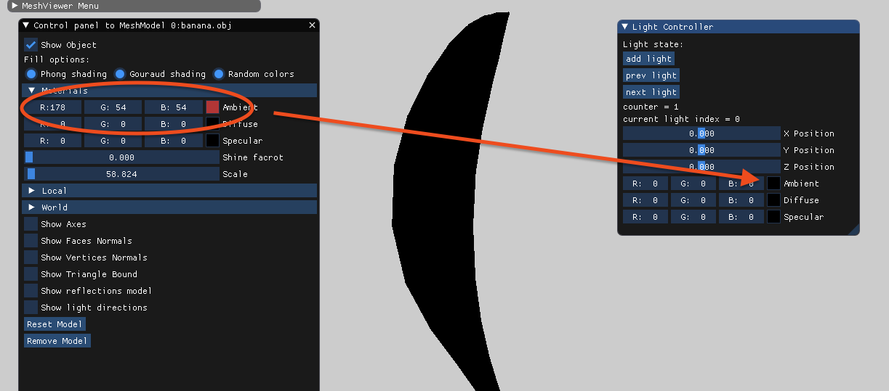

```
now i choise ambiante white red to the banana, and pure red to the light,
and we see that the banana is only PURE red,
it is couse the zero's in the light ambient in the green and blue make the final color only red.
```

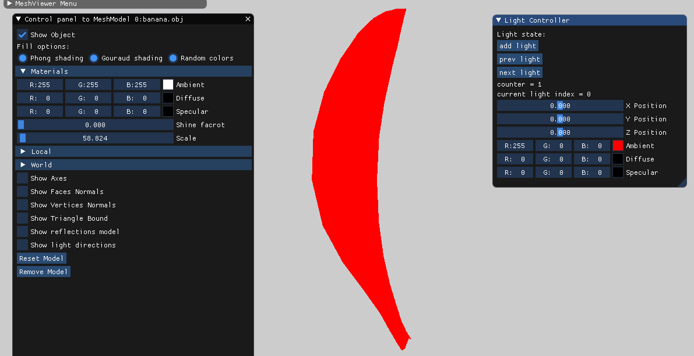


## 2. Compute diffuse

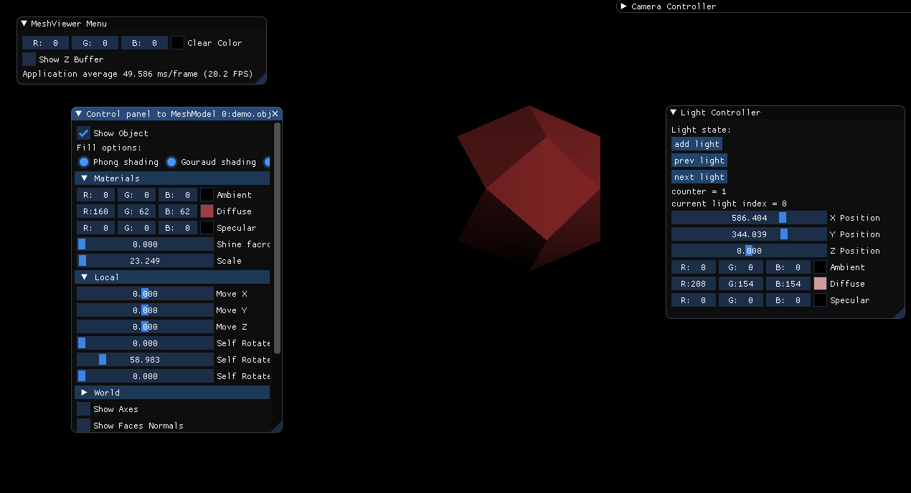

## 3. Compute diffuse Gouraud model

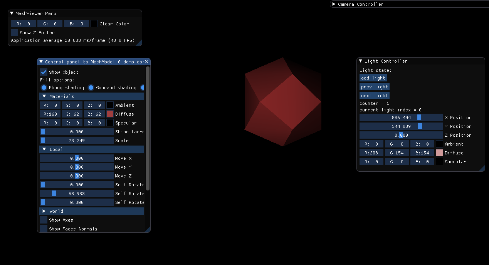

## 4. computes the reflection vector
```
The only light in both images is located at the top right of the frame (about where the yellow circle is).
```

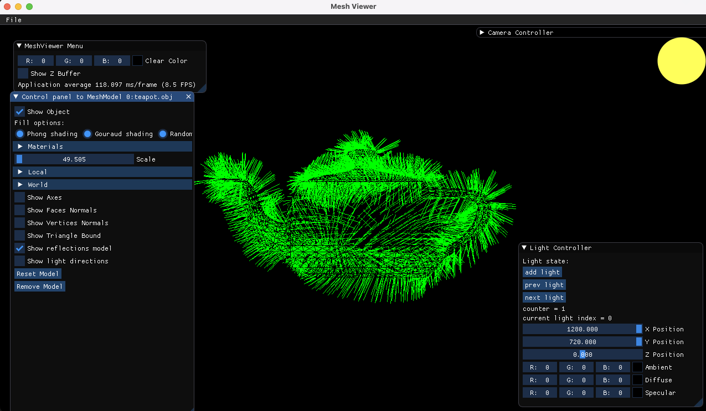

## computes the reflection vector

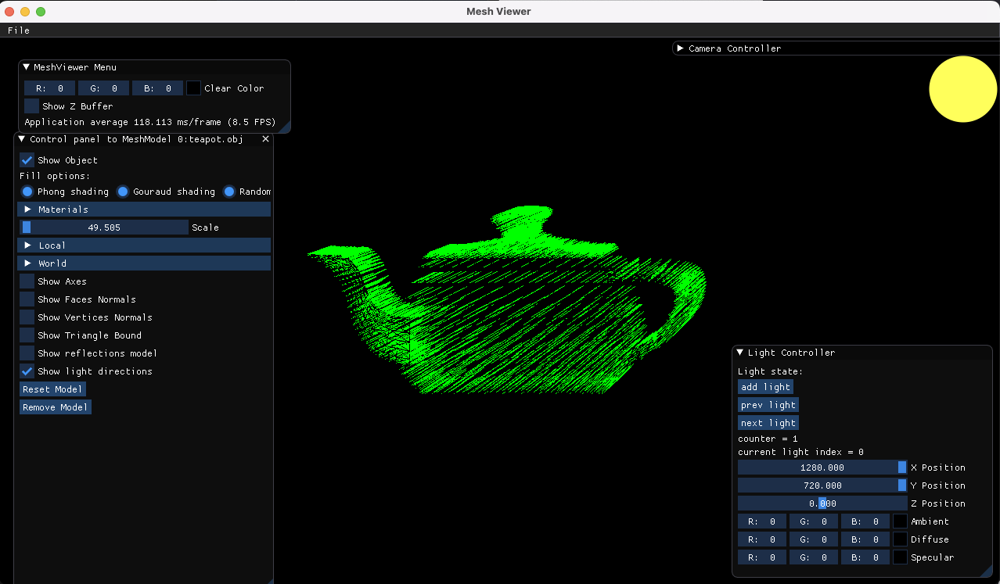


## 5. Compute the specular light with Phong shading

```
This is only the specular part.
```
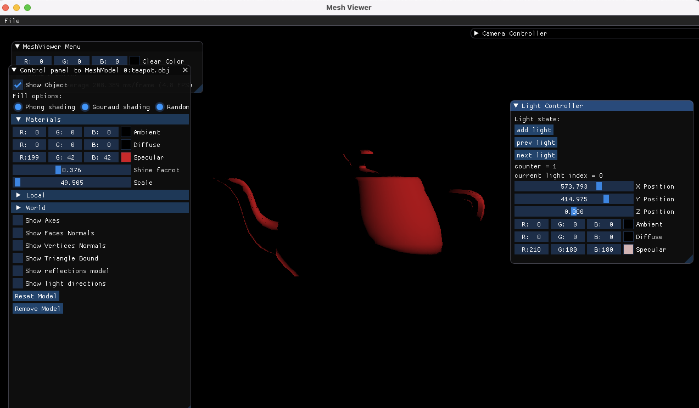

```
And this is the FULL phong model with specular part.
```
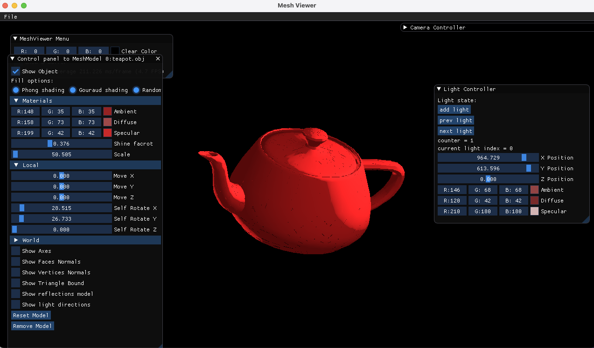

## 6. Demonstrate different models

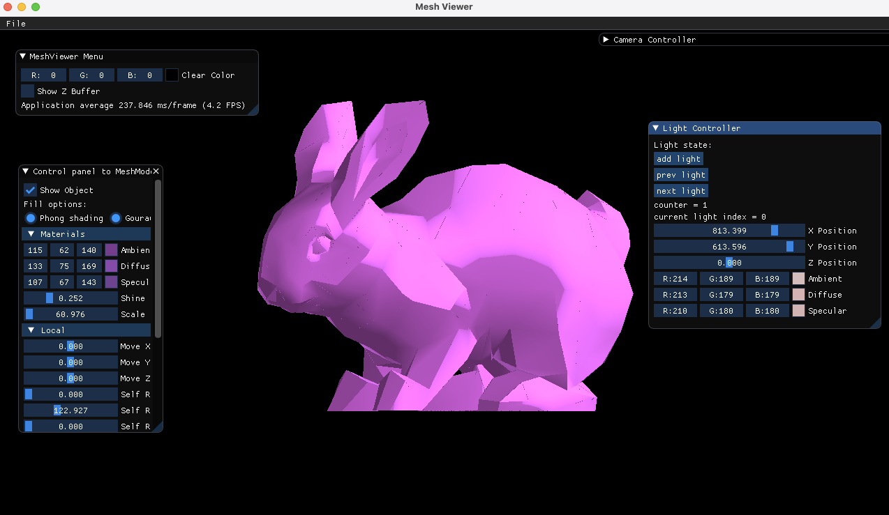

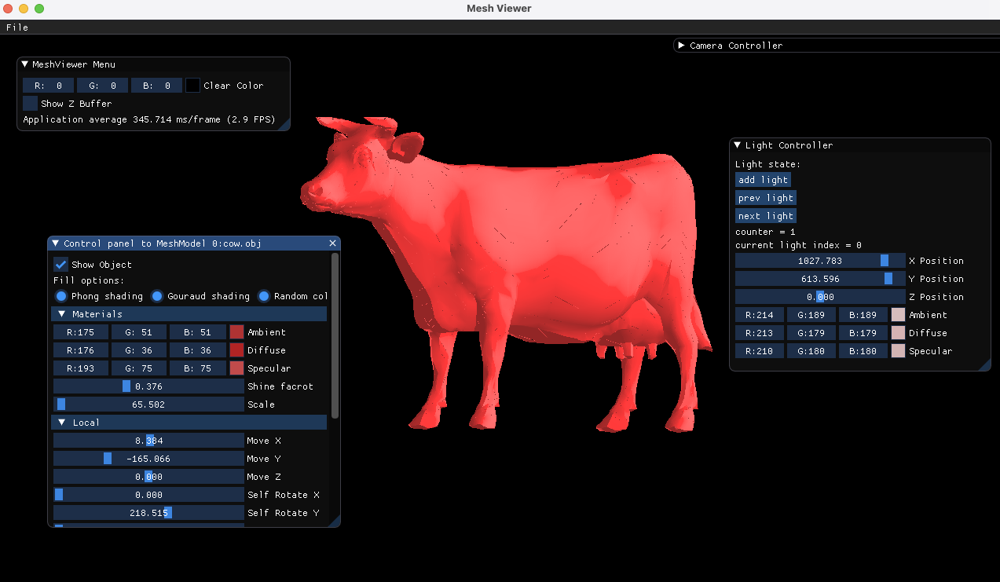

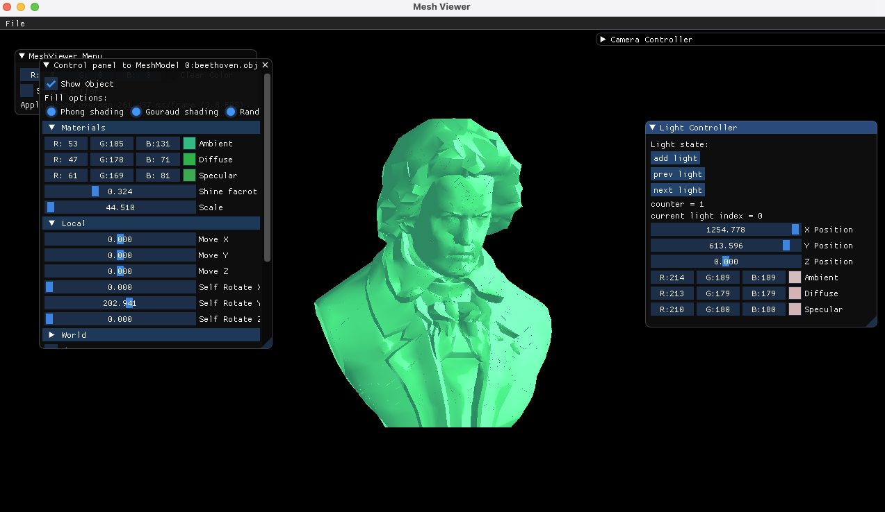