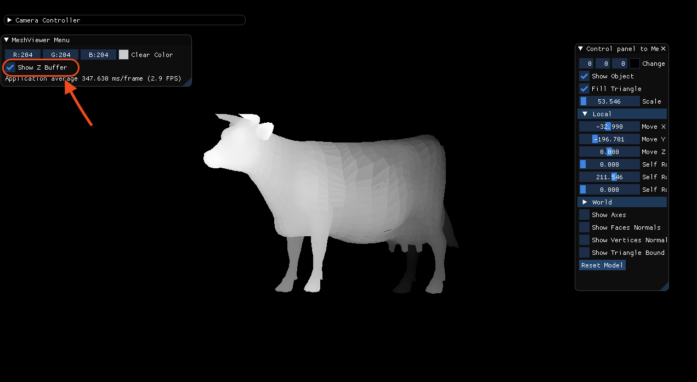

## 1. Draw the bounding rectangle
```
For drawing the bounding rectangle we need to enable that option.
We calculate the color of the ractangle in relation to the depth.
The color black represents it's closeness to the screen and
the color white represents it's farness to the screen.
In every triangle we calculate the avarage of the z cordinate and
check how far it is from the min z cordinate.
```


## 2. Pass
```
we chose to implement the edge walking approach.
```

## 3. Fill the traingle with random color
```
To fill the traingles with color we enable the 'Fill Traingle' option.
```


## 4. Z - buffer
```
First we can see the z buffer algoritem on one model:
```

```
It is possible to recognize that the back of the cow is darker than the front as we expected to see.
```
### Bunny model
```
The bunny model using color buffer:
```

```
The bunny model using z buffer:
```


### Camera model

```
The camera model using color buffer:
```


```
The camera model using z buffer:
```


### Banana model

```
The Banana model using color buffer:
```


```
The Banana model using z buffer:
```

